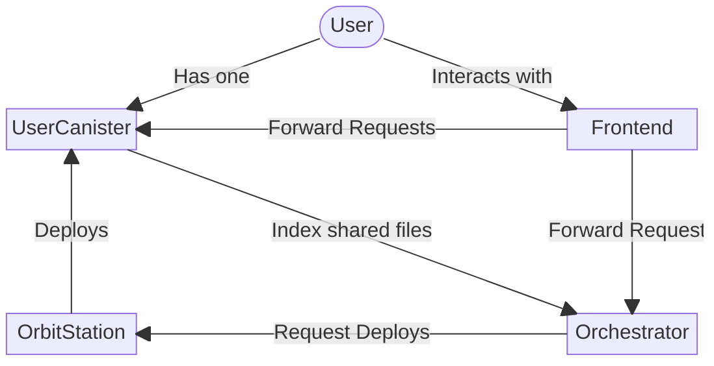
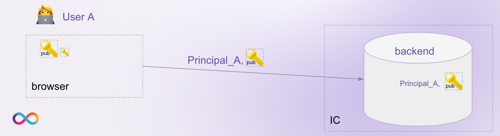
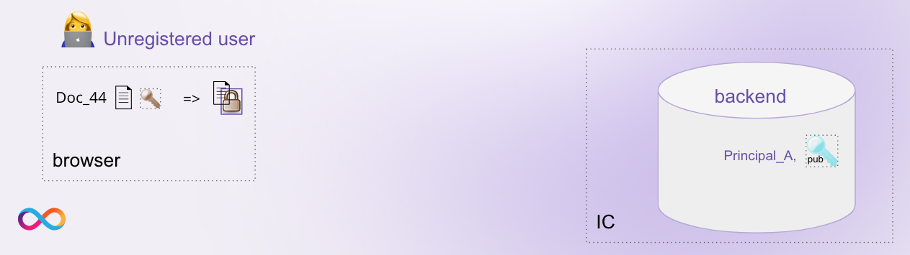
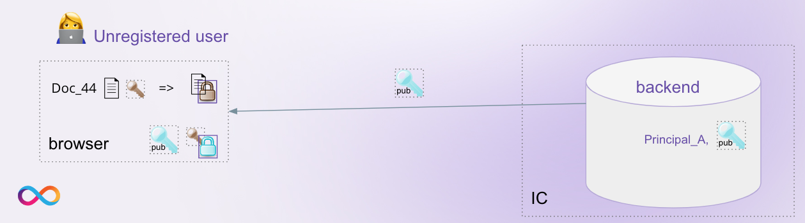
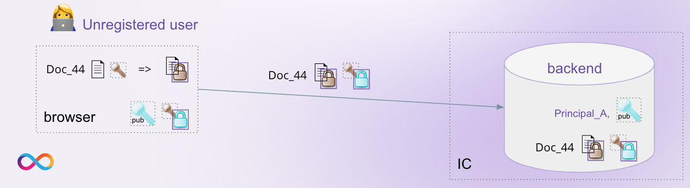
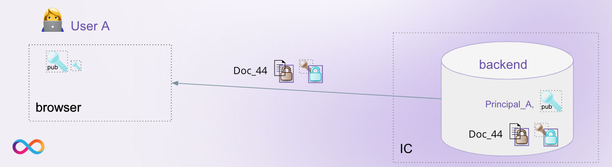
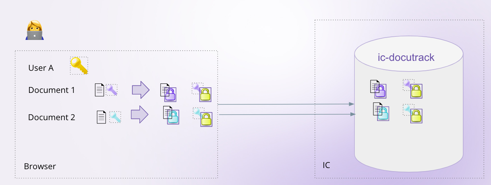
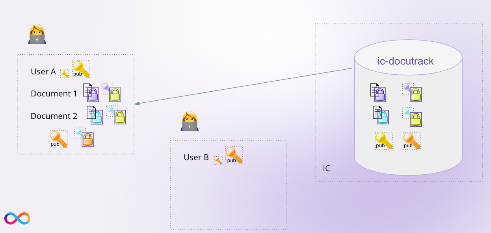
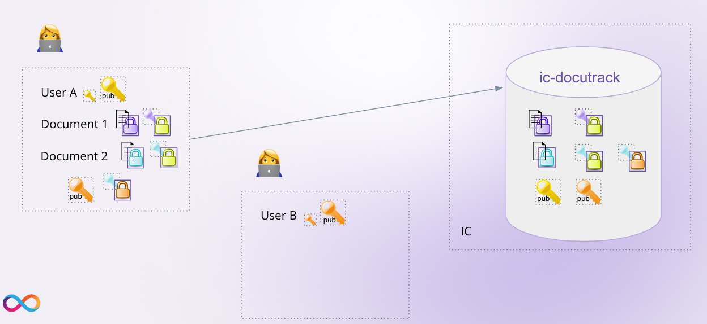
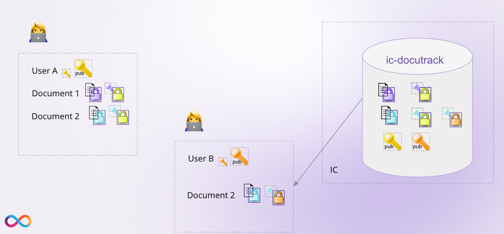

# How Docutrack is implemented?

## Architecture

The Docutrack architecture consists of the following components:

- **Orchestrator**: The orchestrator canister is the coordinator of the dapp. It manages the user registration to create the user and the organizations data and storage canisters. It also indexes the shared documents for each user to each canister the file belongs to, to provide user a fast access to the shared documents. It provides the following functionality:
  - Register a new user
  - Register a new organization
  - Deploy the user or organization canister
  - Index a shared document (only callable from the user or organization canister)
  - Remove a shared document from the index (only callable from the user or organization canister)
- **User Canister**: The user canister is the main canister for a user. It serves as a storage for the user's documents and provides the following functionality:
  - Upload a Document
  - Create a document and then upload it chunk by chunk
  - Share a document with another user or organization
  - Revoke access to a shared document
  - List all shared documents
  - List files
  - Explore the file tree of the storage
  - Download a document
  - Delete a document
- **Organization Canister**: The organization canister is similar to the user canister, but it is used for organizations. It provides the same functionality as the user canister, but it is used for organizations instead of users.
- **Orbit station**: The orbit station canister is implemented by the DFINITY Foundation and is used to securely and reliably deploy the user canisters and handle automatically the canister upgrades and the cycles management.
- **Frontend**: The frontend is a web application that provides the user interface for the dapp. It is implemented using React and communicates with the canisters using the Internet Computer's HTTP API.

## User Registration

Users are linked to their [Internet Identity](https://internetcomputer.org/internet-identity) in the frontend after login, the corresponding principal will be used for calling backend API queries and
updates.

After registration a public / private key pair is created for the user.
The public key is stored in the **Orchestrator** for each registered user, together with their name.

## Document Upload

When a document is to be uploaded, a symmetric secret key for the document is created in the (potentially unregistered) user's frontend.

In the example above, this user is called Bob. The document is encrypted with this secret key.

As a next step, the frontend obtains the public key of the registered user who created the request link, Alice, from the backend.
The document’s secret key is encrypted for Alice.

Both the encrypted document and the encrypted secret key are sent to the backend where they are stored.

## Document Access

The Frontend of registered user Alice can get the encrypted doc together with the encrypted key from the backend canister.
Using the private key, Alice’s frontend can decrypt the document and process it.

## Cryptography

The creation of keys, encryption of documents and their decryption keys is done entirely on the client side.

The dapp uses different kinds of keys [(link to source code)](https://github.com/icp-hub-it/ic-docutrack/blob/main/frontend/src/frontend/src/lib/crypto.js):

- **Documents**: Symmetric **AES-GCM** secret key: used to encrypt and decrypt a document. This secret key is stored encrypted for one or several users in the user canister.
- **Users**:
  - **RSA-OAEP public key**: used to encrypt the symmetric AES secret key of a document the user should have access to. The public key for each registered user is stored in the **Orchestrator**.
  **RSA-OAEP private key**: used to decrypt the symmetric AES secret key of a document stored in the user canister. Once the frontend decrypts the secret key, it can use this key for decrypting the corresponding document stored in the backend. The private key never leaves the client-side and is not stored anywhere else.

For each user and for each document separate keys are being used.

In order for Alice to share Document 2 with Bob (who needs to have an II to support this functionality), the secret key of Document 2 needs to be encrypted for Bob’s public key.

This key is then added to the **User Canister**.

Bob’s frontend can now download the document together with the document key encrypted for Bob and decrypt it locally.

