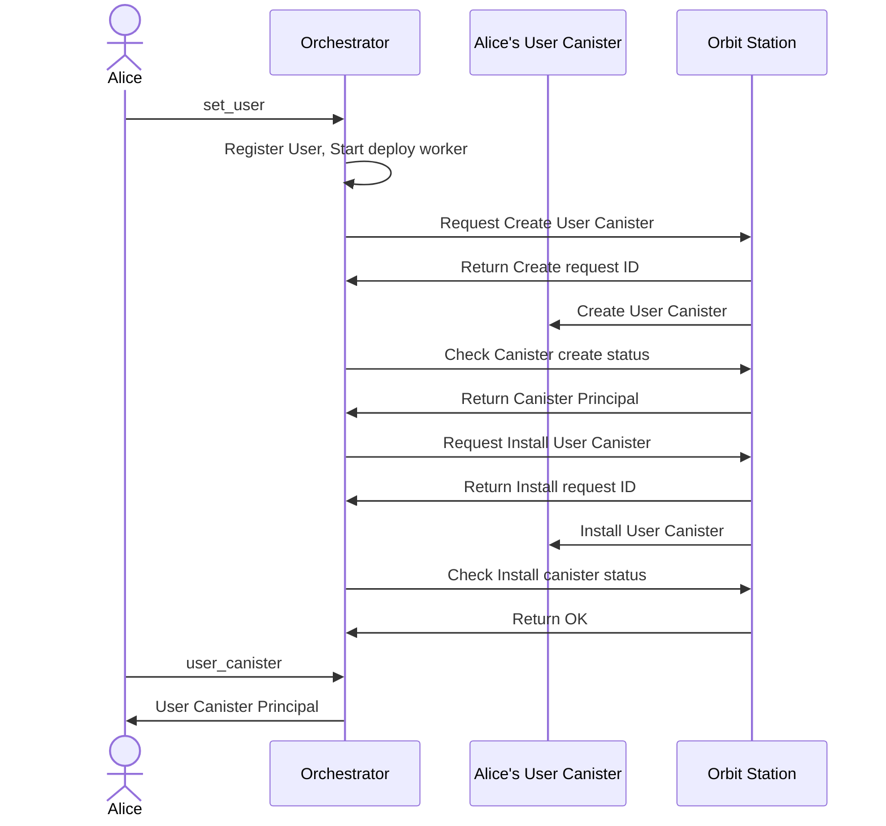
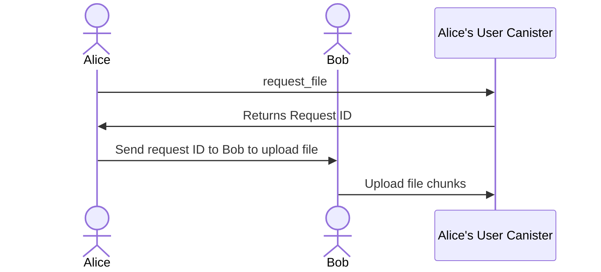
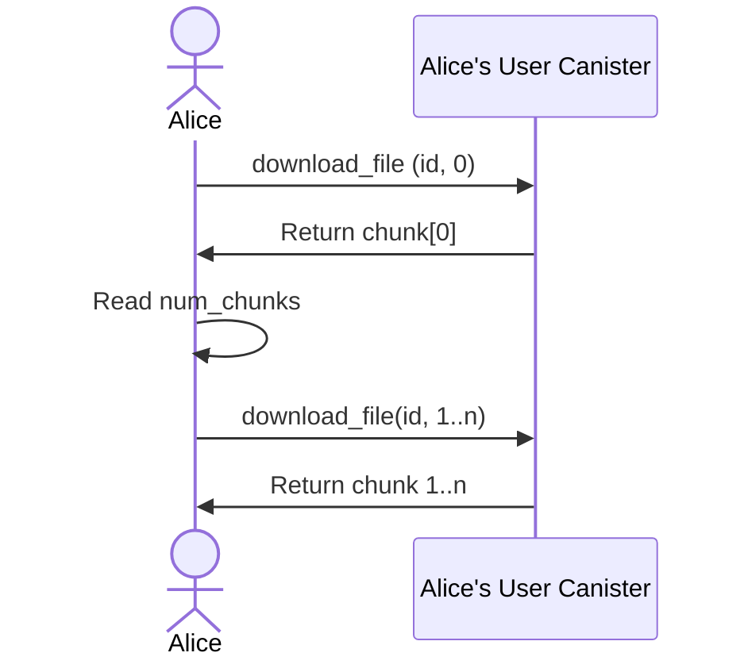
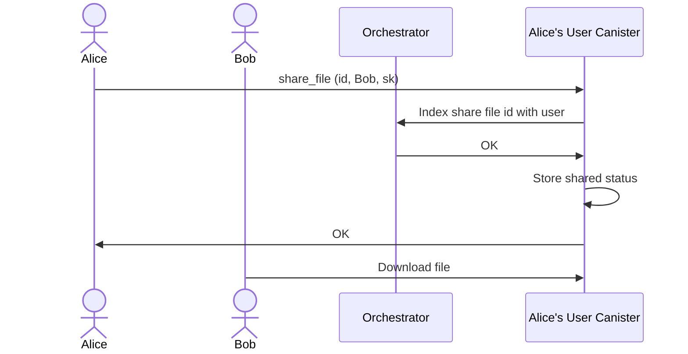
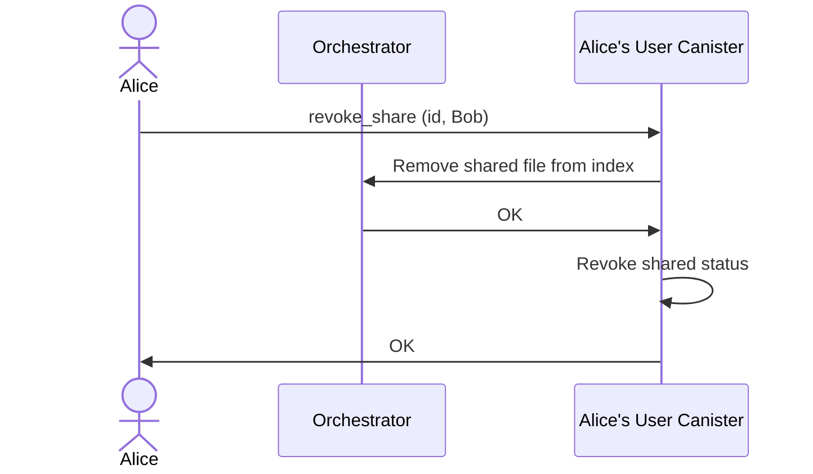
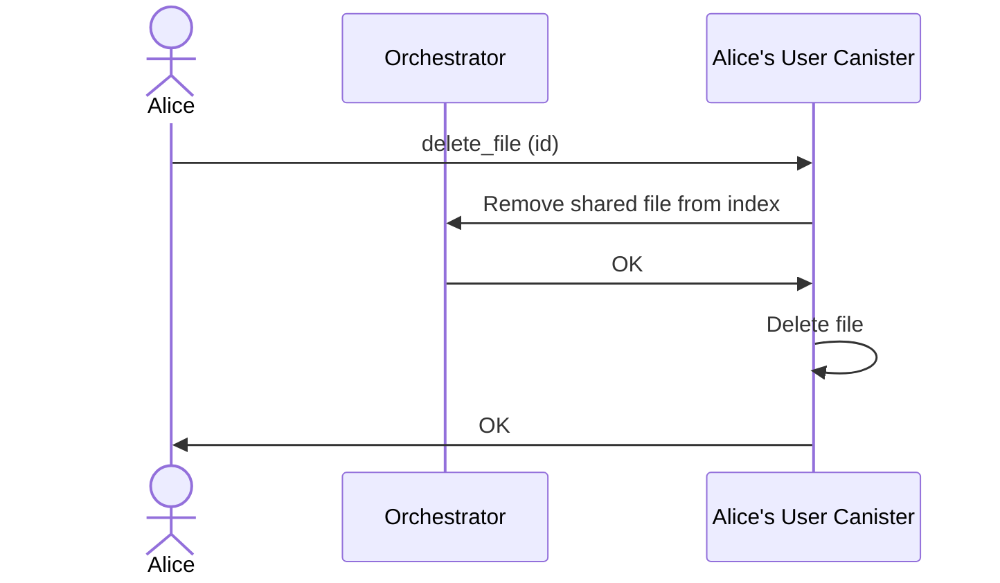

# Inter Canister Flows

## Create a new user canister

```mermaid
sequenceDiagram
    actor U as Alice
    participant O as Orchestrator
    participant UC as Alice's User Canister
    participant OS as Orbit Station
    U->>O: set_user
    O->>O: Register User, Start deploy worker
    O->>OS: Request Create User Canister
    OS->>O: Return Create request ID
    OS->>UC: Create User Canister
    O->>OS: Check Canister create status
    OS->>O: Return Canister Principal
    O->>OS: Request Install User Canister
    OS->>O: Return Install request ID
    OS->>UC: Install User Canister
    O->>OS: Check Install canister status
    OS->>O: Return OK
    U->>O: user_canister
    O->>U: User Canister Principal

```

## Upload a document

```mermaid
sequenceDiagram
    actor A as Alice
    actor B as Bob
    participant UC as Alice's User Canister
    A->>UC: request_file
    UC->>A: Returns Request ID
    A->>B: Send request ID to Bob to upload file
    B->>UC: Upload file chunks

```

## Download a document

```mermaid
sequenceDiagram
    actor A as Alice
    participant UC as Alice's User Canister
    A->>UC: download_file (id, 0)
    UC->>A: Return chunk[0]
    A->>A: Read num_chunks
    A->>UC: download_file(id, 1..n)
    UC->>A: Return chunk 1..n

```

## Share a document

```mermaid
sequenceDiagram
    actor A as Alice
    actor B as Bob
    participant O as Orchestrator
    participant UC as Alice's User Canister
    A->>UC: share_file (id, Bob, sk)
    UC->>O: Index share file id with user
    O->>UC: OK
    UC->>UC: Store shared status
    UC->>A: OK
    B->>UC: Download file

```

## Revoke access to a document

```mermaid
sequenceDiagram
    actor A as Alice
    participant O as Orchestrator
    participant UC as Alice's User Canister
    A->>UC: revoke_share (id, Bob)
    UC->>O: Remove shared file from index
    O->>UC: OK
    UC->>UC: Revoke shared status
    UC->>A: OK

```

## Delete a document

```mermaid
sequenceDiagram
    actor A as Alice
    participant O as Orchestrator
    participant UC as Alice's User Canister
    A->>UC: delete_file (id)
    UC->>O: Remove shared file from index
    O->>UC: OK
    UC->>UC: Delete file
    UC->>A: OK
```
