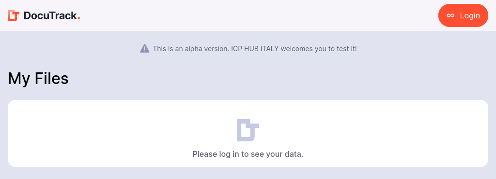
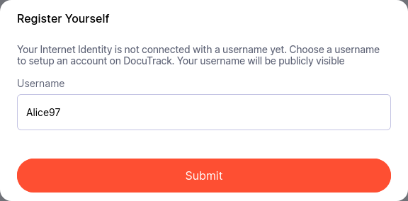
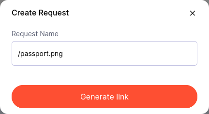

# Getting Started with Docutrack

You can try Docutrack in your browser by visiting Docutrack Frontend at [l7rii-2yaaa-aaaao-a4liq-cai.icp0.io](https://l7rii-2yaaa-aaaao-a4liq-cai.icp0.io/).

We’ll walk through the example of Alice requesting a passport picture from Bob and then sharing it with Luca.

## Sign up

First of all we need to login with our Internet Identity. You can use any Internet Identity you have, or create a new one at [Internet Identity](https://identity.ic0.app/).

If this is our first access, we need to register by specifying a username:

Then we submit the request and the orchestrator will start to create a storage canister for us. This can take a few seconds, so please be patient.

And eventually after the canister is created, we will be redirected to the main page of Docutrack and we'll see our username in the topbar.

## Uploading a file

At this point we want to upload a new document on Alice's storage canister, but from a different browser, maybe with an unknown user. So the first step is to create a new upload request. We click on the "Create new file request" button and fill in the form with the details of the request.

This will generate a link with a UUID that we can share with Bob. We can copy the link and send it to Bob via email, chat, or any other means.

Then Bob can open the link in his browser, and he will be able to upload the file. He clicks on the "Upload file" button, selects the file (in this case, a passport picture), and submits it.

Once the file is uploaded, Bob will see a confirmation message and the file will be stored in Alice's storage canister.

If we now go to our files, we'll see the uploaded file in the list of files.

And we can also click on the file to see its details, including the file name, size, and the date it was uploaded.

## Sharing a file

Once a file is uploaded, we can share it with other users.

In this case, we want to share the passport picture with Luca. We click on the "Share" button next to the file in the list of files.

From the name field we can select Luca from the list of users that have access to our storage canister.

Once the file is shared, we can see the list of users that have access to the file in the "Access" section.

